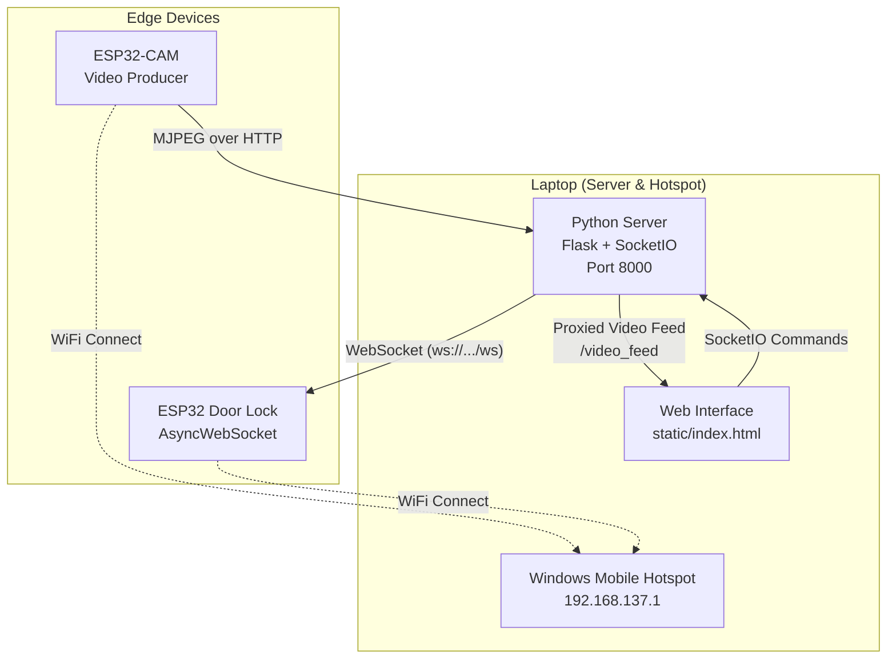

# Giai đoạn 2: Nền tảng WebSocket & Truyền tải Video

## 🎯 Mục tiêu
Mục tiêu chính của giai đoạn này là thiết lập hạ tầng truyền thông và luồng dữ liệu hình ảnh cho hệ thống:
- **Streaming Video**: Truyền tải luồng video trực tiếp từ ESP32-CAM về máy chủ.
- **WebSocket Server**: Xây dựng máy chủ điều phối dữ liệu trung tâm bằng Python (Flask + SocketIO).
- **Giao diện điều khiển (Web GUI)**: Tạo trang web để quan sát camera và điều khiển cửa.
- **Kết nối Real-time**: Sử dụng WebSocket để giao tiếp tức thời giữa Server và ESP32 Door Lock.

## 🛠️ Phần cứng (Hardware)
| ESP32-CAM | Thu thập hình ảnh và stream video MJPEG |
| ESP32 Main (Door Lock) | Điều khiển relay khóa cửa |
| Laptop | Phát WiFi Hotspot và chạy Python Server |

---

## 🌐 Sơ đồ Kiến trúc (Network Architecture)



### Đặc điểm chính:
1. **Real-time Control**: Server duy trì kết nối WebSocket liên tục với ESP32 Door Lock.
2. **Video Proxy**: Luồng video được proxy qua OpenCV để ổn định hơn.
3. **Safety Features**: ESP32 tự động khóa cửa nếu mất kết nối (heartbeat timeout).

---

## 📁 Cấu trúc thư mục

```
phase 2/
├── server/
│   ├── main.py                 # Flask + SocketIO server
│   ├── config.py               # Cấu hình IP, Port
│   ├── requirements.txt        # Thư viện Python
│   ├── static/
│   │   └── index.html          # Giao diện Web GUI
│   └── logs/
│       └── server.log          # Log hoạt động
└── esp32_main_phase2/
    └── esp32_main_phase2.ino   # Code ESP32 Door Lock
```

---

## 🔧 Cài đặt

### 1. Thư viện Python (Server)

**requirements.txt:**
```txt
flask>=3.0.0
flask-socketio>=5.3.0
websocket-client>=1.7.0
opencv-python>=4.8.0
```

Cài đặt:
```bash
cd "phase 2/server"
pip install -r requirements.txt
```

### 2. Thư viện Arduino (ESP32)

Cài đặt qua Arduino Library Manager:
- `AsyncTCP` by me-no-dev
- `ESPAsyncWebServer` by me-no-dev

### 3. Cấu hình WiFi

**Windows Mobile Hotspot:**
1. Settings → Network & Internet → Mobile Hotspot
2. Bật Mobile Hotspot
3. Ghi lại SSID và Password

**Trong code ESP32:**
```cpp
const char* ssid = "wifi32";         // Tên Hotspot
const char* password = "123456789";  // Mật khẩu Hotspot
```

**Trong config.py:**
```python
ESP32_MAIN_IP = "192.168.137.xxx"    # IP của ESP32 Door Lock
ESP32_CAM_IP = "192.168.137.yyy"     # IP của ESP32-CAM
```

---

## 💻 Code Server (main.py)

```python
from flask import Flask, render_template, Response
from flask_socketio import SocketIO, emit
import cv2
import threading
import time
from websocket import create_connection
from config import *

app = Flask(__name__, static_folder='static', template_folder='static')
socketio = SocketIO(app, cors_allowed_origins="*")

# ===== DOOR LOCK CONNECTION =====
lock_ws = None
LOCK_WS_URL = f"ws://{ESP32_MAIN_IP}/ws"

def connect_to_lock():
    global lock_ws
    try:
        lock_ws = create_connection(LOCK_WS_URL, timeout=3)
        print(f"✅ Connected to Door Lock at {LOCK_WS_URL}")
        return True
    except Exception as e:
        print(f"⚠️ Could not connect to Door Lock: {e}")
        lock_ws = None
        return False

def lock_monitor():
    while True:
        if lock_ws is None:
            connect_to_lock()
        time.sleep(5)

threading.Thread(target=lock_monitor, daemon=True).start()

# ===== VIDEO PROCESSING =====
def generate_frames():
    cap = cv2.VideoCapture(ESP32_CAM_STREAM)
    while True:
        success, frame = cap.read()
        if not success:
            cap.open(ESP32_CAM_STREAM)
            time.sleep(1)
            continue
        ret, buffer = cv2.imencode('.jpg', frame)
        yield (b'--frame\r\nContent-Type: image/jpeg\r\n\r\n' + buffer.tobytes() + b'\r\n')

# ===== ROUTES =====
@app.route('/')
def index():
    return render_template('index.html')

@app.route('/video_feed')
def video_feed():
    return Response(generate_frames(), mimetype='multipart/x-mixed-replace; boundary=frame')

# ===== SOCKET.IO EVENTS =====
@socketio.on('command')
def handle_command(data):
    global lock_ws
    if lock_ws:
        try:
            lock_ws.send(data)
            emit('response', f"OK: Sent {data} to Door Lock")
        except:
            lock_ws = None
            emit('response', "ERROR: Door Lock connection lost")
    else:
        emit('response', "ERROR: Door Lock not connected")

if __name__ == "__main__":
    socketio.run(app, host=SERVER_HOST, port=SERVER_PORT)
```

---

## 🔌 Code ESP32 Door Lock (esp32_main_phase2.ino)

### Tính năng chính:
- **AsyncWebSocket**: WebSocket server trên port 80, path `/ws`
- **WiFi Optimization**: Disable sleep, max TX power, auto-reconnect
- **Heartbeat Safety**: Tự động khóa cửa sau 10 giây mất kết nối
- **Signal Monitoring**: Broadcast tín hiệu WiFi mỗi 5 giây

### Code tóm tắt:
```cpp
#include <WiFi.h>
#include <AsyncTCP.h>
#include <ESPAsyncWebServer.h>

const int RELAY_PIN = 32;
bool doorIsOpen = false;

AsyncWebServer server(80);
AsyncWebSocket ws("/ws");

// WiFi Optimization
void optimizeWiFi() {
    WiFi.setSleep(false);
    WiFi.setTxPower(WIFI_POWER_19_5dBm);
    WiFi.setAutoReconnect(true);
}

// Safety: Auto-lock after 10s without heartbeat
void checkSafetyConditions() {
    if (clientConnected && doorIsOpen && (millis() - lastHeartbeat > 10000)) {
        lockDoor();
        ws.textAll("TIMEOUT:AUTO_LOCKED");
    }
}

// WebSocket Handler
void onWsEvent(AsyncWebSocket *server, AsyncWebSocketClient *client, 
               AwsEventType type, void *arg, uint8_t *data, size_t len) {
    if (type == WS_EVT_CONNECT) {
        client->text("Connected to Door Lock");
        client->text(doorIsOpen ? "OK:OPEN" : "OK:LOCKED");
    }
    else if (type == WS_EVT_DATA) {
        String cmd = String((char*)data);
        if (cmd == "OPEN_DOOR") { openDoor(); ws.textAll("OK:Door opened"); }
        else if (cmd == "LOCK_DOOR") { lockDoor(); ws.textAll("OK:Door locked"); }
        else if (cmd == "STATUS") { ws.textAll(doorIsOpen ? "OK:OPEN" : "OK:LOCKED"); }
    }
}

void setup() {
    optimizeWiFi();
    WiFi.begin(ssid, password);
    // ... wait for connection
    
    ws.onEvent(onWsEvent);
    server.addHandler(&ws);
    server.begin();
}

void loop() {
    ws.cleanupClients();
    checkSafetyConditions();
    monitorWiFiSignal();
    delay(10);
}
```

## 📸 Code ESP32-CAM (esp32_cam_phase2.ino)

### Tính năng chính:
- **Streaming MJPEG**: Cung cấp luồng video qua giao thức HTTP.
- **Web Server cơ bản**: Trang web tích hợp để kiểm tra luồng video nhanh.
- **Tối ưu hóa WiFi**: Tắt chế độ ngủ để giảm độ trễ truyền tải.

### Code mẫu:
```cpp
#include "esp_camera.h"
#include <WiFi.h>
#include <WebServer.h>

// ===== ĐỊNH NGHĨA CHÂN CHO AI-THINKER =====
#define PWDN_GPIO_NUM     32
#define RESET_GPIO_NUM    -1
#define XCLK_GPIO_NUM      0
#define SIOD_GPIO_NUM     26
#define SIOC_GPIO_NUM     27
#define Y9_GPIO_NUM       35
#define Y8_GPIO_NUM       34
#define Y7_GPIO_NUM       39
#define Y6_GPIO_NUM       36
#define Y5_GPIO_NUM       21
#define Y4_GPIO_NUM       19
#define Y3_GPIO_NUM       18
#define Y2_GPIO_NUM        5
#define VSYNC_GPIO_NUM    25
#define HREF_GPIO_NUM     23
#define PCLK_GPIO_NUM     22

// ===== THÔNG TIN WIFI =====
const char* ssid = "wifi32";
const char* password = "123456789";

// ===== STREAMING HANDLER =====
WebServer server(80);

void handle_stream() {
  WiFiClient client = server.client();
  String response = "HTTP/1.1 200 OK\r\n";
  response += "Content-Type: multipart/x-mixed-replace; boundary=frame\r\n";
  response += "Access-Control-Allow-Origin: *\r\n";
  response += "\r\n";
  client.print(response);

  while (client.connected()) {
    camera_fb_t *fb = esp_camera_fb_get();
    if (!fb) continue;

    client.print("--frame\r\n");
    client.print("Content-Type: image/jpeg\r\n");
    client.print("Content-Length: " + String(fb->len) + "\r\n\r\n");
    client.write(fb->buf, fb->len);
    client.print("\r\n");
    esp_camera_fb_return(fb);

    delay(80); // ~12 FPS
    if (!client.connected()) break;
  }
}

void setup() {
  Serial.begin(115200);
  Serial.setDebugOutput(true);

  // Kết nối WiFi
  WiFi.begin(ssid, password);
  WiFi.setSleep(false);
  while (WiFi.status() != WL_CONNECTED) {
    delay(500);
    Serial.print(".");
  }
  Serial.println("\nWiFi connected, IP: " + WiFi.localIP().toString());

  // Camera config
  camera_config_t config;
  config.ledc_channel = LEDC_CHANNEL_0;
  config.ledc_timer = LEDC_TIMER_0;
  config.pin_d0 = Y2_GPIO_NUM;
  config.pin_d1 = Y3_GPIO_NUM;
  config.pin_d2 = Y4_GPIO_NUM;
  config.pin_d3 = Y5_GPIO_NUM;
  config.pin_d4 = Y6_GPIO_NUM;
  config.pin_d5 = Y7_GPIO_NUM;
  config.pin_d6 = Y8_GPIO_NUM;
  config.pin_d7 = Y9_GPIO_NUM;
  config.pin_xclk = XCLK_GPIO_NUM;
  config.pin_pclk = PCLK_GPIO_NUM;
  config.pin_vsync = VSYNC_GPIO_NUM;
  config.pin_href = HREF_GPIO_NUM;
  config.pin_sscb_sda = SIOD_GPIO_NUM;
  config.pin_sscb_scl = SIOC_GPIO_NUM;
  config.pin_pwdn = PWDN_GPIO_NUM;
  config.pin_reset = RESET_GPIO_NUM;
  config.xclk_freq_hz = 20000000;
  config.pixel_format = PIXFORMAT_JPEG;
  config.frame_size = FRAMESIZE_QVGA; // 320x240, ổn định
  config.jpeg_quality = 12;
  config.fb_count = 2;

  if (psramFound()) {
    config.frame_size = FRAMESIZE_VGA; // 640x480
    config.jpeg_quality = 10;
    config.fb_count = 2;
  }

  esp_err_t err = esp_camera_init(&config);
  if (err != ESP_OK) {
    Serial.printf("Camera init failed: 0x%x\n", err);
    while (1) delay(1000);
  }
  Serial.println("Camera init OK");

  server.on("/stream", HTTP_GET, handle_stream);

  server.on("/", HTTP_GET, []() {
    String html = "<h2>ESP32-CAM Streaming Ready</h2>";
    html += "<p>Stream URL: <b>/stream</b></p>";
    html += "";
    server.send(200, "text/html", html);
  });

  server.begin();
  Serial.println("Camera streaming ready!");
  Serial.println("Mở trình duyệt: http://" + WiFi.localIP().toString() + "/stream");
}

void loop() {
  server.handleClient();
  delay(1);
}
```

---

## 🚀 Chạy hệ thống

### 1. Upload code ESP32
```
1. Mở Arduino IDE
2. Cài đặt thư viện AsyncTCP và ESPAsyncWebServer
3. Upload code lên ESP32
4. Xem Serial Monitor để lấy IP
```

### 2. Khởi động Server
```bash
cd "phase 2/server"
python main.py
```

### 3. Truy cập Web GUI
- Mở trình duyệt: `http://localhost:8000`
- Hoặc từ thiết bị khác trong cùng mạng: `http://192.168.137.1:8000`

---

## 🐞 Khắc phục lỗi thường gặp

| Lỗi | Nguyên nhân | Giải pháp |
|-----|-------------|-----------|
| `Door Lock not connected` | ESP32 chưa bật hoặc sai IP | Kiểm tra IP trong Serial Monitor |
| Video stream lag | Băng thông WiFi yếu | Giảm độ phân giải camera |
| `ModuleNotFoundError` | Thiếu thư viện Python | `pip install -r requirements.txt` |
| Cửa tự khóa sau vài giây | Heartbeat timeout | Đảm bảo Server đang chạy và kết nối ổn định |
| ESP32 không kết nối WiFi | Sai SSID/Password | Kiểm tra cấu hình trong code |

---

## 📊 Giao thức WebSocket

### Commands (Client → ESP32):
| Command | Response | Mô tả |
|---------|----------|-------|
| `OPEN_DOOR` | `OK:Door opened` | Mở cửa |
| `LOCK_DOOR` | `OK:Door locked` | Khóa cửa |
| `STATUS` | `OK:OPEN` hoặc `OK:LOCKED` | Kiểm tra trạng thái |
| `PING` | `PONG` | Kiểm tra kết nối |

### Broadcasts (ESP32 → All Clients):
| Message | Mô tả |
|---------|-------|
| `SIGNAL:GOOD:-55` | Tín hiệu WiFi (level:rssi) |
| `ACK:OPEN_DOOR` | Xác nhận lệnh |
| `TIMEOUT:AUTO_LOCKED` | Cửa tự khóa do mất kết nối |

---

## ✅ Tiêu chí hoàn thành Phase 2

- [x] ESP32-CAM stream video ổn định
- [x] Python Server proxy video qua OpenCV
- [x] WebSocket real-time giữa Server và ESP32 Door Lock
- [x] Web GUI hiển thị video và điều khiển cửa
- [x] Safety: Auto-lock khi mất kết nối
- [x] WiFi optimization cho kết nối ổn định

