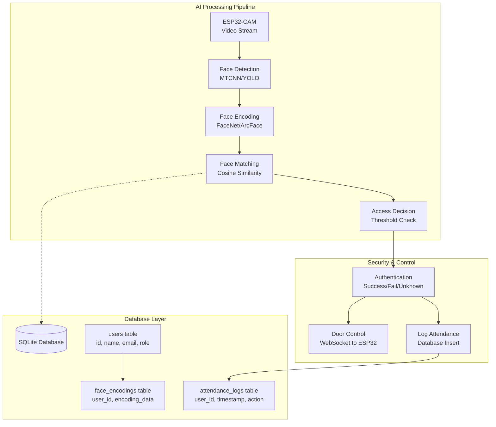

# Giai đoạn 3: Face ID Engine & Tích hợp Cơ sở dữ liệu

## 🎯 Mục tiêu
Mục tiêu chính của giai đoạn này là xây dựng hệ thống nhận diện khuôn mặt thông minh và tích hợp cơ sở dữ liệu:
- **AI Model Integration**: Tích hợp mô hình AI (YOLO/Face Recognition) vào Python Server để xử lý khung hình video.
- **Attendance Database**: Thiết lập cơ sở dữ liệu (SQLite/PostgreSQL) để quản lý danh sách người dùng và lịch sử chấm công.
- **Real-time Recognition**: So khớp khuôn mặt từ luồng video với cơ sở dữ liệu để nhận diện cá nhân (Thành công/Thất bại/Người lạ).
- **Security Logic**: Xây dựng logic bảo mật (ví dụ: chỉ mở cửa khi Face ID + Database khớp).

## 🛠️ Phần cứng (Hardware)
Sử dụng lại toàn bộ hạ tầng từ Phase 2:
| ESP32-CAM | Cung cấp luồng video MJPEG cho AI xử lý |
| ESP32 Main (Door Lock) | Nhận lệnh mở cửa từ AI Server |
| Laptop | Chạy AI Server với Face Recognition |

---

## 🧠 Kiến trúc AI & Database



### Đặc điểm chính:
1. **Multi-stage Pipeline**: Detection → Encoding → Matching → Decision
2. **Database-driven**: Tất cả thông tin người dùng và face encodings được lưu trữ
3. **Real-time Processing**: Xử lý video frame liên tục với độ trễ < 1.5s
4. **Attendance Logging**: Tự động ghi lại lịch sử ra vào

---

## 📁 Cấu trúc thư mục

```
phase 3/
├── server/
│   ├── main.py                 # Flask + SocketIO + AI Server
│   ├── face_recognition.py     # Face detection & recognition logic
│   ├── database.py             # Database models & operations
│   ├── config.py               # AI model configs & thresholds
│   ├── requirements.txt        # AI libraries (OpenCV, face_recognition, etc.)
│   ├── models/                 # Pre-trained AI models
│   │   ├── shape_predictor_68_face_landmarks.dat
│   │   └── dlib_face_recognition_resnet_model_v1.dat
│   ├── database/
│   │   └── attendance.db       # SQLite database file
│   ├── static/
│   │   ├── index.html          # Enhanced Web GUI with user management
│   │   ├── admin.html          # Admin panel for user registration
│   │   └── css/style.css       # Styling
│   └── uploads/                # Temporary face images for registration
└── esp32_code/
    └── (unchanged from Phase 2) # ESP32 code remains the same
```

---

## 🔧 Cài đặt

### 1. Thư viện Python (AI Server)

**requirements.txt:**
```txt
# Phase 2 dependencies
flask>=3.0.0
flask-socketio>=5.3.0
websocket-client>=1.7.0
opencv-python>=4.8.0

# Phase 3 AI dependencies
face-recognition>=1.3.0
dlib>=19.24.0
numpy>=1.24.0
Pillow>=10.0.0
scikit-learn>=1.3.0
sqlite3  # Built-in with Python

# Optional: Advanced models
# tensorflow>=2.13.0
# torch>=2.0.0
# facenet-pytorch>=2.5.0
```

Cài đặt:
```bash
cd "phase 3/server"
pip install -r requirements.txt

# Download dlib models (if needed)
wget http://dlib.net/files/shape_predictor_68_face_landmarks.dat.bz2
wget http://dlib.net/files/dlib_face_recognition_resnet_model_v1.dat.bz2
bunzip2 *.bz2
mkdir models && mv *.dat models/
```

### 2. Cấu hình Database

**database.py:**
```python
import sqlite3
import json
import numpy as np
import os

class AttendanceDB:
    def __init__(self, db_path="database/attendance.db"):
        self.db_path = db_path
        os.makedirs(os.path.dirname(db_path), exist_ok=True)
        self.init_database()
    
    def init_database(self):
        """Initialize database tables"""
        conn = sqlite3.connect(self.db_path)
        cursor = conn.cursor()
        
        # Create tables: users, face_encodings, attendance_logs
        cursor.execute('''CREATE TABLE IF NOT EXISTS users (
            id INTEGER PRIMARY KEY AUTOINCREMENT,
            name TEXT NOT NULL, email TEXT UNIQUE, role TEXT DEFAULT 'employee',
            created_at TIMESTAMP DEFAULT CURRENT_TIMESTAMP, is_active BOOLEAN DEFAULT 1)''')
        
        cursor.execute('''CREATE TABLE IF NOT EXISTS face_encodings (
            id INTEGER PRIMARY KEY AUTOINCREMENT, user_id INTEGER,
            encoding_data TEXT NOT NULL, confidence REAL DEFAULT 0.0,
            created_at TIMESTAMP DEFAULT CURRENT_TIMESTAMP,
            FOREIGN KEY (user_id) REFERENCES users (id))''')
        
        cursor.execute('''CREATE TABLE IF NOT EXISTS attendance_logs (
            id INTEGER PRIMARY KEY AUTOINCREMENT, user_id INTEGER,
            action TEXT NOT NULL, confidence REAL,
            timestamp TIMESTAMP DEFAULT CURRENT_TIMESTAMP, ip_address TEXT,
            FOREIGN KEY (user_id) REFERENCES users (id))''')
        
        conn.commit()
        conn.close()
    
    def add_user(self, name, email, role="employee"):
        """Add new user to database"""
        conn = sqlite3.connect(self.db_path)
        cursor = conn.cursor()
        try:
            cursor.execute("INSERT INTO users (name, email, role) VALUES (?, ?, ?)", (name, email, role))
            user_id = cursor.lastrowid
            conn.commit()
            return user_id
        except sqlite3.IntegrityError:
            return None
        finally:
            conn.close()
    
    def add_face_encoding(self, user_id, encoding, confidence=0.0):
        """Store face encoding for user"""
        conn = sqlite3.connect(self.db_path)
        cursor = conn.cursor()
        encoding_json = json.dumps(encoding.tolist())
        cursor.execute("INSERT INTO face_encodings (user_id, encoding_data, confidence) VALUES (?, ?, ?)",
                      (user_id, encoding_json, confidence))
        conn.commit()
        conn.close()
    
    def get_all_encodings(self):
        """Get all face encodings with user info"""
        conn = sqlite3.connect(self.db_path)
        cursor = conn.cursor()
        cursor.execute('''SELECT u.id, u.name, u.role, fe.encoding_data, fe.confidence
                         FROM users u JOIN face_encodings fe ON u.id = fe.user_id
                         WHERE u.is_active = 1''')
        
        results = []
        for row in cursor.fetchall():
            user_id, name, role, encoding_json, confidence = row
            encoding = np.array(json.loads(encoding_json))
            results.append({'user_id': user_id, 'name': name, 'role': role, 
                          'encoding': encoding, 'confidence': confidence})
        conn.close()
        return results
    
    def log_attendance(self, user_id, action, confidence, ip_address=None):
        """Log attendance event"""
        conn = sqlite3.connect(self.db_path)
        cursor = conn.cursor()
        cursor.execute("INSERT INTO attendance_logs (user_id, action, confidence, ip_address) VALUES (?, ?, ?, ?)",
                      (user_id, action, confidence, ip_address))
        conn.commit()
        conn.close()
```

---

## 🤖 Face Recognition Engine

**face_recognition.py:**
```python
import cv2
import face_recognition
import numpy as np
import time

class FaceRecognitionEngine:
    def __init__(self, tolerance=0.6, model='hog'):
        self.tolerance = tolerance
        self.model = model
        self.known_encodings = []
        self.known_names = []
        self.known_user_ids = []
        self.frame_count = 0
        self.total_time = 0
        
    def load_known_faces(self, face_data):
        """Load known faces from database"""
        self.known_encodings = [face['encoding'] for face in face_data]
        self.known_names = [face['name'] for face in face_data]
        self.known_user_ids = [face['user_id'] for face in face_data]
        print(f"✅ Loaded {len(self.known_encodings)} known faces")
    
    def detect_and_recognize(self, frame):
        """Detect and recognize faces in frame"""
        start_time = time.time()
        
        # Resize for faster processing
        small_frame = cv2.resize(frame, (0, 0), fx=0.25, fy=0.25)
        rgb_small_frame = cv2.cvtColor(small_frame, cv2.COLOR_BGR2RGB)
        
        # Find faces
        face_locations = face_recognition.face_locations(rgb_small_frame, model=self.model)
        face_encodings = face_recognition.face_encodings(rgb_small_frame, face_locations)
        
        results = []
        for (top, right, bottom, left), face_encoding in zip(face_locations, face_encodings):
            # Scale back up face locations
            top, right, bottom, left = top*4, right*4, bottom*4, left*4
            
            # Match against known faces
            matches = face_recognition.compare_faces(self.known_encodings, face_encoding, tolerance=self.tolerance)
            face_distances = face_recognition.face_distance(self.known_encodings, face_encoding)
            
            name, user_id, confidence = "Unknown", None, 0.0
            if len(face_distances) > 0:
                best_match_index = np.argmin(face_distances)
                if matches[best_match_index]:
                    name = self.known_names[best_match_index]
                    user_id = self.known_user_ids[best_match_index]
                    confidence = 1 - face_distances[best_match_index]
            
            results.append({
                'name': name, 'user_id': user_id, 'confidence': confidence,
                'location': (top, right, bottom, left), 'is_known': user_id is not None
            })
        
        # Performance tracking
        self.frame_count += 1
        self.total_time += time.time() - start_time
        return results
    
    def encode_face_from_image(self, image_path):
        """Extract face encoding from image file"""
        try:
            image = face_recognition.load_image_file(image_path)
            encodings = face_recognition.face_encodings(image)
            return encodings[0] if len(encodings) > 0 else None
        except Exception as e:
            print(f"Error encoding face: {e}")
            return None
```

---

## 💻 Enhanced Server Code (main.py)

```python
from flask import Flask, render_template, Response, request, jsonify
from flask_socketio import SocketIO, emit
import cv2
import threading
import time
from websocket import create_connection
from face_recognition_engine import FaceRecognitionEngine
from database import AttendanceDB
from config import *

app = Flask(__name__, static_folder='static', template_folder='static')
socketio = SocketIO(app, cors_allowed_origins="*")

# Global components
face_engine = FaceRecognitionEngine(tolerance=FACE_TOLERANCE, model=FACE_MODEL)
db = AttendanceDB()
lock_ws = None

# Door lock connection (from Phase 2)
def connect_to_lock():
    global lock_ws
    try:
        lock_ws = create_connection(f"ws://{ESP32_MAIN_IP}/ws", timeout=3)
        print(f"✅ Connected to Door Lock")
        return True
    except Exception as e:
        print(f"⚠️ Could not connect to Door Lock: {e}")
        lock_ws = None
        return False

# AI-Enhanced video processing
def generate_frames():
    cap = cv2.VideoCapture(ESP32_CAM_STREAM)
    known_faces = db.get_all_encodings()
    face_engine.load_known_faces(known_faces)
    
    frame_skip, frame_counter = 3, 0
    
    while True:
        success, frame = cap.read()
        if not success:
            cap.open(ESP32_CAM_STREAM)
            time.sleep(1)
            continue
        
        # AI Processing every 3rd frame
        if frame_counter % frame_skip == 0:
            faces = face_engine.detect_and_recognize(frame)
            
            for face in faces:
                top, right, bottom, left = face['location']
                name, confidence = face['name'], face['confidence']
                color = (0, 255, 0) if face['is_known'] else (0, 0, 255)
                
                # Draw bounding box and label
                cv2.rectangle(frame, (left, top), (right, bottom), color, 2)
                label = f"{name} ({confidence:.2f})" if face['is_known'] else "Unknown"
                cv2.rectangle(frame, (left, bottom - 35), (right, bottom), color, cv2.FILLED)
                cv2.putText(frame, label, (left + 6, bottom - 6), cv2.FONT_HERSHEY_DUPLEX, 0.6, (255, 255, 255), 1)
                
                # Auto door control
                if face['is_known'] and confidence > AUTO_UNLOCK_THRESHOLD:
                    auto_unlock_door(face['user_id'], confidence)
        
        frame_counter += 1
        ret, buffer = cv2.imencode('.jpg', frame)
        yield (b'--frame\r\nContent-Type: image/jpeg\r\n\r\n' + buffer.tobytes() + b'\r\n')

def auto_unlock_door(user_id, confidence):
    """Auto unlock door for recognized user"""
    global lock_ws
    if lock_ws:
        try:
            lock_ws.send("OPEN_DOOR")
            db.log_attendance(user_id, "AUTO_ENTRY", confidence)
            socketio.emit('recognition_event', {
                'user_id': user_id, 'action': 'AUTO_ENTRY', 
                'confidence': confidence, 'timestamp': time.time()
            })
        except:
            lock_ws = None

# Routes
@app.route('/')
def index():
    return render_template('index.html')

@app.route('/video_feed')
def video_feed():
    return Response(generate_frames(), mimetype='multipart/x-mixed-replace; boundary=frame')

@app.route('/api/users', methods=['POST'])
def add_user():
    data = request.json
    user_id = db.add_user(data.get('name'), data.get('email'), data.get('role', 'employee'))
    return jsonify({'success': bool(user_id), 'user_id': user_id})

@app.route('/api/upload_face', methods=['POST'])
def upload_face():
    if 'image' not in request.files:
        return jsonify({'success': False, 'error': 'No image uploaded'})
    
    file = request.files['image']
    user_id = request.form.get('user_id')
    
    if file and user_id:
        filename = f"temp_face_{user_id}_{int(time.time())}.jpg"
        filepath = os.path.join('uploads', filename)
        file.save(filepath)
        
        encoding = face_engine.encode_face_from_image(filepath)
        if encoding is not None:
            db.add_face_encoding(user_id, encoding)
            os.remove(filepath)
            # Reload known faces
            known_faces = db.get_all_encodings()
            face_engine.load_known_faces(known_faces)
            return jsonify({'success': True})
        else:
            os.remove(filepath)
            return jsonify({'success': False, 'error': 'No face detected'})
    
    return jsonify({'success': False, 'error': 'Invalid request'})

# Socket.IO events
@socketio.on('command')
def handle_command(data):
    global lock_ws
    if lock_ws:
        try:
            lock_ws.send(data)
            emit('response', f"OK: Sent {data}")
        except:
            lock_ws = None
            emit('response', "ERROR: Connection lost")
    else:
        emit('response', "ERROR: Not connected")

if __name__ == "__main__":
    os.makedirs('uploads', exist_ok=True)
    print("🚀 Starting AI-Enhanced Attendance System...")
    socketio.run(app, host=SERVER_HOST, port=SERVER_PORT, debug=False)
```

---

## ⚙️ Configuration (config.py)

```python
# ===== NETWORK CONFIGURATION (from Phase 2) =====
SERVER_HOST = "0.0.0.0"
SERVER_PORT = 8000
ESP32_MAIN_IP = "192.168.137.100"  # Update with actual IP
ESP32_CAM_IP = "192.168.137.101"   # Update with actual IP
ESP32_CAM_STREAM = f"http://{ESP32_CAM_IP}/stream"

# ===== FACE RECOGNITION CONFIGURATION =====
FACE_MODEL = "hog"  # 'hog' (CPU, faster) or 'cnn' (GPU, more accurate)
FACE_TOLERANCE = 0.6  # Lower = stricter matching (0.4-0.8 recommended)
AUTO_UNLOCK_THRESHOLD = 0.8  # Confidence threshold for auto door unlock

# ===== DATABASE CONFIGURATION =====
DATABASE_PATH = "database/attendance.db"

# ===== PERFORMANCE SETTINGS =====
FRAME_SKIP = 3  # Process every Nth frame (higher = faster, less accurate)
MAX_FACE_SIZE = 640  # Max width for face processing (pixels)

# ===== SECURITY SETTINGS =====
ADMIN_PASSWORD = "admin123"  # Change this!
SESSION_TIMEOUT = 3600  # 1 hour in seconds
MAX_FAILED_ATTEMPTS = 5
```

---

## 🎨 Enhanced Web Interface

**static/index.html (Key sections):**
```html
<!DOCTYPE html>
<html lang="en">
<head>
    <meta charset="UTF-8">
    <meta name="viewport" content="width=device-width, initial-scale=1.0">
    <title>AI Face Recognition - Attendance System</title>
    <script src="https://cdnjs.cloudflare.com/ajax/libs/socket.io/4.0.1/socket.io.js"></script>
    <link rel="stylesheet" href="css/style.css">
</head>
<body>
    <div class="container">
        <header>
            <h1>🤖 AI Face Recognition System</h1>
            <div class="status-bar">
                <span id="connection-status">🔴 Disconnected</span>
                <span id="recognition-stats">FPS: 0 | Users: 0</span>
            </div>
        </header>

        <div class="main-content">
            <div class="video-section">
                <div class="video-container">
                    
                    <div class="video-overlay">
                        <div id="recognition-info">
                            <span id="last-recognition">No recent recognition</span>
                        </div>
                    </div>
                </div>
                
                <div class="controls">
                    <button id="open-door" class="btn btn-success">🔓 Open Door</button>
                    <button id="lock-door" class="btn btn-danger">🔒 Lock Door</button>
                    <button id="manual-scan" class="btn btn-primary">👁️ Manual Scan</button>
                </div>
            </div>

            <div class="info-section">
                <div class="panel">
                    <h3>📊 Live Statistics</h3>
                    <div id="stats-content">
                        <p>Processing FPS: <span id="fps">0</span></p>
                        <p>Known Users: <span id="known-users">0</span></p>
                    </div>
                </div>

                <div class="panel">
                    <h3>📝 Recent Activity</h3>
                    <div id="activity-log">
                        <p>No recent activity</p>
                    </div>
                </div>
            </div>
        </div>
    </div>

    <script>
        const socket = io();
        
        socket.on('connect', function() {
            document.getElementById('connection-status').innerHTML = '🟢 Connected';
            loadStats();
        });

        socket.on('recognition_event', function(data) {
            const info = document.getElementById('last-recognition');
            const timestamp = new Date(data.timestamp * 1000).toLocaleTimeString();
            info.innerHTML = `${data.action} - User ${data.user_id} (${(data.confidence * 100).toFixed(1)}%) at ${timestamp}`;
            addToActivityLog(`User ${data.user_id} - ${data.action} (${(data.confidence * 100).toFixed(1)}%)`);
        });

        // Control buttons
        document.getElementById('open-door').onclick = () => socket.emit('command', 'OPEN_DOOR');
        document.getElementById('lock-door').onclick = () => socket.emit('command', 'LOCK_DOOR');

        function loadStats() {
            fetch('/api/stats')
                .then(response => response.json())
                .then(data => {
                    document.getElementById('fps').textContent = data.face_recognition.fps;
                    document.getElementById('known-users').textContent = data.known_faces;
                });
        }

        function addToActivityLog(message) {
            const log = document.getElementById('activity-log');
            const timestamp = new Date().toLocaleTimeString();
            const entry = document.createElement('p');
            entry.innerHTML = `[${timestamp}] ${message}`;
            log.insertBefore(entry, log.firstChild);
            
            // Keep only last 10 entries
            while (log.children.length > 10) {
                log.removeChild(log.lastChild);
            }
        }

        setInterval(loadStats, 5000); // Auto-refresh stats
    </script>
</body>
</html>
```

---

## 🚀 Chạy hệ thống Phase 3

### 1. Chuẩn bị Database
```bash
cd "phase 3/server"
python -c "from database import AttendanceDB; db = AttendanceDB(); print('Database initialized')"
```

### 2. Khởi động AI Server
```bash
python main.py
```

### 3. Đăng ký người dùng đầu tiên
1. Truy cập: `http://localhost:8000/admin`
2. Thêm người dùng mới
3. Upload ảnh khuôn mặt
4. Hệ thống sẽ tự động extract face encoding

### 4. Kiểm tra hoạt động
- Video stream hiển thị bounding box xung quanh khuôn mặt
- Tên người dùng và confidence score được hiển thị
- Cửa tự động mở khi nhận diện thành công (confidence > 0.8)

---

## 🐞 Khắc phục lỗi thường gặp

| Lỗi | Nguyên nhân | Giải pháp |
|-----|-------------|-----------|
| `No module named 'face_recognition'` | Thiếu thư viện AI | `pip install face-recognition dlib` |
| `dlib installation failed` | Thiếu Visual Studio Build Tools | Cài đặt VS Build Tools hoặc dùng conda |
| Face detection quá chậm | Model 'cnn' trên CPU | Đổi sang model 'hog' trong config.py |
| Không nhận diện được | Threshold quá thấp | Tăng FACE_TOLERANCE lên 0.7-0.8 |
| Database locked | Nhiều process truy cập DB | Đảm bảo chỉ chạy 1 server instance |
| Auto-unlock không hoạt động | Confidence thấp | Giảm AUTO_UNLOCK_THRESHOLD xuống 0.6 |

---

## 📊 Performance Tuning

### CPU Optimization:
```python
# config.py
FACE_MODEL = "hog"          # Faster on CPU
FRAME_SKIP = 5              # Process every 5th frame
MAX_FACE_SIZE = 480         # Smaller processing size
```

### GPU Acceleration (Optional):
```python
# config.py  
FACE_MODEL = "cnn"          # More accurate with GPU
# Requires: pip install tensorflow-gpu
```

### Memory Optimization:
```python
# Limit known faces in memory
MAX_KNOWN_FACES = 100
# Periodic cleanup of old attendance logs
LOG_RETENTION_DAYS = 30
```

---

## ✅ Tiêu chí hoàn thành Phase 3

- [x] Face detection và recognition hoạt động theo thời gian thực
- [x] Database lưu trữ users và face encodings
- [x] Mở khóa cử tự động khi nhận diện thành công
- [x] Web interface hiển thị kết quả nhận diện
- [x] Log điểm danh tự động
- [x] Admin panel để quản lý người dùng
- [x] Xử lý lỗi và cơ chế khôi phục

---

## 🔮 Chuẩn bị cho Phase 4

Phase 4 sẽ tập trung vào:
- **Cross-Device Integration**: Kết nối ESP32-CAM → AI Server → ESP32 Door Lock
- **LCD Display**: Hiển thị thông tin user trên màn hình LCD
- **Advanced Security**: Multi-factor authentication, time-based access
- **Mobile App**: Ứng dụng di động để quản lý từ xa